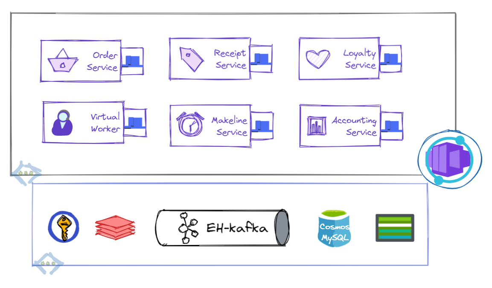

# reddog-spring-dapr

### :warning: :construction: Java version of [reddog-code](https://github.com/Azure/reddog-code) for [Azure Container Apps (ACA)](https://learn.microsoft.com/en-us/azure/container-apps/overview) and [Azure Kubernetes Services (AKS)](https://learn.microsoft.com/en-us/azure/aks/intro-kubernetes) is WIP

### Background

This repo, based on [reddog-code](https://github.com/Azure/reddog-code), is intended for Java/Spring developers to understand Azure hosting options and Dapr, which has bindings that integrate with managed backing services. Using a retail scenario that depicts a typical event-driven microservices architecture, this codebase (and associated lab) will ease the migration and modernization of cloud-native Java workloads on Azure. 




### Pre-reqs:

- [JDK-17](https://learn.microsoft.com/en-us/java/openjdk/overview)
- `JAVA_HOME` set to ^ JDK location
- [Maven](https://maven.apache.org/download.cgi) for building and running the project
- [Dapr](https://docs.dapr.io/getting-started/install-dapr-cli/) for running the project locally

### Setup:

To run locally, after completing above pre-reqs, install gnu-parallel using `brew install parallel`[^1] , and update the env variables in `start.sh`; then:

```bash
./start.sh
```

#### :construction: Deployment to Azure, via bicep and GH-actions, are WIP

[^1]:[WSL users](https://docs.brew.sh/Homebrew-on-Linux)

### Contributing

This project welcomes contributions and suggestions.  Most contributions require you to agree to a
Contributor License Agreement (CLA) declaring that you have the right to, and actually do, grant us
the rights to use your contribution. For details, visit https://cla.opensource.microsoft.com.

When you submit a pull request, a CLA bot will automatically determine whether you need to provide
a CLA and decorate the PR appropriately (e.g., status check, comment). Simply follow the instructions
provided by the bot. You will only need to do this once across all repos using our CLA.

This project has adopted the [Microsoft Open Source Code of Conduct](https://opensource.microsoft.com/codeofconduct/).
For more information see the [Code of Conduct FAQ](https://opensource.microsoft.com/codeofconduct/faq/) or
contact [opencode@microsoft.com](mailto:opencode@microsoft.com) with any additional questions or comments.